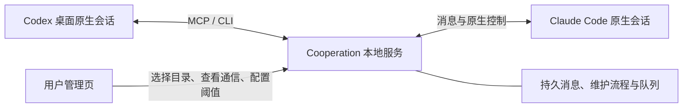

# Codex Claude Bridge

**让已有的 Codex 与 Claude Code 会话直接协作，让长任务在上下文压缩后接着做。**

Codex Claude Bridge（管理页与命令名称：**Cooperation**）连接 **Codex 桌面 App** 和 **VS Code 中的 Claude Code**。你继续使用熟悉的原生对话界面，为不同会话分配工作；agent 通过 MCP 或 CLI 互相发送任务、评审意见和结果，本地工作台集中展示多个项目的会话、消息和上下文用量。

它把 **原生会话通信、跨项目管理、上下文交接与恢复** 放进同一条工作流：从“请另一个 agent 看看这个方案”，到“上下文快满了，保存进度、压缩、恢复并接着协作”。

[快速部署](#快速部署) · [发送第一条消息](#发送第一条消息) · [配置-mcp](#配置-mcp) · [自动上下文维护](#自动上下文维护) · [常见问题](#常见问题)

## 核心特色

| 特色 | 带来的体验 |
| --- | --- |
| **协作发生在已有原生会话中** | Codex 留在桌面 App，Claude 留在 VS Code；沿用原任务 ID、已有上下文和客户端模型配置。 |
| **会话可以双向通信** | 把对方地址交给 agent，它就能通过 MCP 或 CLI 发消息；每条消息自动附带真实发送者的名称、ID 和消息编号。 |
| **一个工作台管理多个项目** | 按“目录 → Claude / Codex → 会话”浏览；跨目录指定接收方，右侧集中查看相关通信。 |
| **长任务有完整的上下文交接流程** | 达到阈值后保存交付文档，取得回执，再原生压缩、加载上文、取得恢复回执；原本正在工作的任务才自动继续。 |
| **维护期间，协作消息有序等待** | 每个会话独立持有维护锁与持久队列，恢复后按先后顺序投递；服务重启后仍保留流程与队列。 |
| **轻量、本地运行** | Node.js 原生模块、SQLite、静态管理页，零 npm 运行依赖；复用原客户端登录，无需为 Bridge 另配模型 API Key。 |

**项目的核心差异，是把“原生界面里的 agent 协作”和“长任务的上下文续接”一起做好。** 用户决定参与者与分工，agent 负责交换工作成果，Cooperation 负责传递消息、展示状态和执行获准的维护流程。

例如：让 Codex 实现一个功能，让 Claude 审查方案与变更；发现问题后直接发回原 Codex 会话。两端各自保留自己的任务上下文，协作可以跨越一次上下文压缩继续进行。



## 快速部署

### 1. 准备环境并获取项目

当前部署与原生验收以 **Windows x64** 为基线。

| 需要准备 | 用途 |
| --- | --- |
| Node.js **22.13 或更新版本** | 运行本地服务、MCP 与 CLI；本项目已验证 Node.js 25.2.1。 |
| 已登录的 Codex 桌面 App | 使用已有 Codex 会话及本机发送桥。 |
| VS Code 与已登录的 Claude Code 扩展 | 使用已有 Claude 会话。 |
| Windows .NET Framework C# 编译器 | 构建 Claude 接入程序；构建脚本会检查本机是否已有。 |
| Git，或下载后的源码 ZIP | 获取项目。 |

```powershell
git clone https://github.com/Heisenbear-Rebirth/codex-claude-bridge.git Cooperation
cd Cooperation
node --version
.\scripts\build-claude-wrapper.ps1
```

无需运行 `npm install` 或构建前端。最后一步生成 `bin/claude-wrapper.exe` 和 `bin/claude-wrapper.paths`，其中包含本机路径；**移动项目或换机器后重新构建**。

下文统一以 `E:/Projects/Cooperation` 为安装目录，请替换为你自己的完整路径。**工具安装目录**用于存放服务和数据；**工作项目目录**是 Codex、Claude 实际处理代码或文档的目录，两者可以不同。

### 2. 启动服务并连接 Codex

双击 **启动项目.cmd**，服务会在后台启动并打开管理页。重复启动会复用已有服务；端口以打开的页面为准。

首次使用时，为 Codex 配置一次 [Cooperation MCP](#配置-mcp)，重新连接该 MCP。页面右上角显示 **“Codex 已连接”** 后，即可向 Codex 发消息。只使用 CLI 时，也可以让 Codex 在自己的命令工具中运行一次：

```powershell
node "E:/Projects/Cooperation/bin/coop-service.mjs" start
```

工具会在本地保存已授权的连接，并在启动和发送前检查连通性。**以后正常双击启动即可，不再要求每次都从 Codex 会话启动。** 配好 MCP 后，Codex 重新接入时会自动更新连接，运行中的管理服务会自动重连，无需重启服务。

| 操作 | 入口与效果 |
| --- | --- |
| 打开或启动管理页 | 双击 `启动项目.cmd`；已有服务时直接打开，未运行时后台启动并恢复连接。 |
| 关闭服务 | 双击 `关闭项目.cmd`；正常关闭本项目管理进程并保留数据，Codex 和 Claude 原生会话继续运行。 |
| 在终端查看运行日志 | `node bin/coop.mjs serve --port 11555`；保持终端运行，按 `Ctrl+C` 关闭。 |

Codex App 需要保持可用。断开时页面会显示“Codex 待连接”；打开 Codex 并连接 Cooperation MCP 后，状态会自动更新。工具只复用本机已经取得的授权连接，投递结果不确定的消息仍需核对，不会自动重发。

### 3. 接入 Claude Code

在 VS Code 的用户设置 JSON 中，**合并下面这一项**，指向刚构建的文件：

```json
"claudeCode.claudeProcessWrapper": "E:\\Projects\\Cooperation\\bin\\claude-wrapper.exe"
```

这是一项 **VS Code 用户级配置**，由你明确选择是否启用；构建和启动服务不会自动写入它。保留其他设置；已有其他 wrapper 时，先核对如何整合。该程序会启动扩展原本选定的 Claude，并转发其输入、输出和权限交互。

已接入 wrapper 的新进程会尝试显示 Cooperation 的 peer 消息，并标注“Cooperation 会话消息”。仅转换原生回显的界面副本，不向 Claude 重发、不打断当前工具。现有进程不会热更新；待工作结束后再正常重开面板。该功能已通过隔离协议测试及专用 Claude 会话的工作中投递测试，用户确认面板出现消息气泡；本次消息在原任务结束后被处理，不保证入队即刻显示。默认关闭重开时的自动历史补显，避免旧消息集中出现在对话末尾。新消息的实时显示保留，同一会话内同编号的实时/历史回放共用去重记录。重开后原生面板可能不再显示旧协作消息，可在 Cooperation 管理页查看通信历史。历史补显仅可通过独立的 `peerHistoryVisibility: true` 或 `COOP_PEER_HISTORY_VISIBILITY=1` 显式启用，仍会在末尾补回而非原位置；详见 [wrapper 说明](CLAUDE-WRAPPER.md)。若原生没有输出对应回显，不会凭传输提交结果补造已收到消息。设置启动环境变量 `COOP_PEER_MESSAGE_VISIBILITY=0` 可关闭此功能；也可在项目 `.cooperation/claude-wrapper/config.json` 中设置 `peerMessageVisibility: false`，在下次启动 wrapper 时生效。


随后在管理页：

1. 添加 Claude 实际工作的项目目录。
2. 在该目录下勾选 **“Claude 控制”**。
3. 关闭并重新打开对应的 Claude Code 面板，让它通过 wrapper 启动。
4. 确认原面板的模型、思考强度与权限选项符合你的预期，并检查管理页是否显示连接状态。

“Claude 控制”精确匹配工作目录。勾选“包含子目录”只扩大展示范围；需要接入的子目录应单独添加并允许。这个开关与“启用自动压缩”相互独立。

详细接入、协议说明与回滚步骤见 [Claude 原生控制接入](CLAUDE-WRAPPER.md)。

### 4. 找到要协作的会话

在管理页添加一个或多个工作项目目录，按需选择 **“包含子目录”**。展开目录及其下的 **Codex / Claude**，找到已有会话并点击 **“复制地址”**。

地址形如：

```text
codex://实现功能的会话:原生会话ID
claude://审查方案的会话:原生会话ID
```

也可以使用短地址 `codex:会话ID` 或 `claude:会话ID`。**接收方由你指定；发送者由工具自动识别。**

会话被发现只代表它存在。先打开准备使用的原生会话；Codex 自动维护需要任务已在 App 中加载，Claude 接收和控制需要相应连接在线。

## 发送第一条消息

### 通过 CLI：无需先配置 MCP

把下面的提示发给 **Codex 发送方会话**，替换目标地址与正文：

```text
请通过 Cooperation CLI 向以下目标会话实际发送消息，并告诉我投递结果：

node "E:/Projects/Cooperation/bin/coop.mjs" send --client codex --to "这里粘贴目标会话地址" --text "请审查我的实现方案，并通过 Cooperation 把意见发回本会话。"
```

如果发送方是 **Claude Code**，把 `--client codex` 改为 `--client claude`。该参数表示**谁在发送**；`--to` 表示**发给谁**。

CLI 应由原会话的命令工具执行，以便取得该会话的身份。从独立 PowerShell 手工执行可能无法确认发送者。

长消息、代码片段或复杂引号内容适合先写入发送方获准目录内的 UTF-8 文本文件，再发送：

```powershell
node "E:/Projects/Cooperation/bin/coop.mjs" send --client claude --to "codex:目标会话ID" --file "E:/Work/MyProject/review.txt"
```

正文前会自动带上发送方地址。接收方可以用这个地址回信；是否回复、何时回复由任务要求和 agent 决定。

### 怎样确认第一次协作成功

1. 在目标原生会话中看到消息及发送方信息。
2. 在管理页展开相关会话，右侧找到同一条通信记录。
3. 让接收方回一条消息，并在原发送方会话中确认收到。

`submitted` 表示客户端已接受投递，**对方实际回复才表明它已处理消息**。如返回 `unknown`，先在原会话核对，避免重复发送。

### 给 agent 的协作约定

下面这段适合放在任务开头，或由你决定加入工作项目的指令文件：

```text
本任务允许通过 Cooperation 与以下会话协作：
对方地址：<粘贴地址>
对方分工：<例如：审查方案、复核测试结果>

需要对方协助时，优先使用已加载的 Cooperation send_message 工具；未加载 MCP 时使用本机 Cooperation CLI。
发送时说明目标、必要背景、需要对方完成的事项和相关文件位置。
取得反馈后结合当前任务处理；需要回复时使用消息中附带的发送方地址。
发送后检查投递结果；结果不确定时先核对原会话。
```

Cooperation 负责通信和上下文维护。任务分工、文件修改范围与结果验收由你和参与会话约定。

## 配置 MCP

CLI 和 MCP 都连接同一个管理服务。**配置 MCP 是让 agent 能直接调用工具；它不会替你启动管理服务或完成 Claude 接入。**

把配置放在**需要调用工具的工作项目**中，并把其中的安装路径替换为自己的路径。已有配置文件时合并相应条目。

### Codex

在工作项目的 `.codex/config.toml` 中加入以下配置；Codex 需要信任该项目才能加载项目级配置。配置位置和格式参见 [OpenAI MCP 文档](https://developers.openai.com/codex/mcp/)。

```toml
[mcp_servers.cooperation]
command = "node"
args = ["E:/Projects/Cooperation/bin/coop.mjs", "mcp", "--client", "codex"]
tool_timeout_sec = 75
env_vars = ["CODEX_APP_TOOLS_PIPE_PATH", "CODEX_THREAD_ID", "CODEX_MCP_NODE_PATH"]
```

### Claude Code

在工作项目根目录的 `.mcp.json` 中合并以下配置。Claude Code 对项目级 MCP 的加载确认与连接检查见 [Claude Code MCP 文档](https://code.claude.com/docs/en/mcp)。

```json
{
  "mcpServers": {
    "cooperation": {
      "command": "node",
      "args": ["E:/Projects/Cooperation/bin/coop.mjs", "mcp", "--client", "claude"]
    }
  }
}
```

重新加载对应客户端的 MCP 配置，完成客户端要求的信任或权限确认，并检查 `cooperation` 是否已连接。配置样例也保存在 [Codex](examples/codex.config.toml) 与 [Claude](examples/claude.mcp.json) 文件中。

### 让会话调用 MCP

```text
请实际调用 Cooperation MCP 的 send_message 工具：
to：<粘贴目标会话地址>
message：请审查刚才的方案，完成后通过 Cooperation 回复本会话。

调用后告诉我投递结果。
```

本项目只提供两个业务工具：

| 工具 | 参数 | 用途 |
| --- | --- | --- |
| `send_message` | `to`、`message` | 向指定会话发送消息。 |
| `context_checkpoint` | `cycleId`、`stage`、`receiptToken`、`documentPath` | 在收到维护请求后，确认交付或恢复阶段。 |

会话发现和通信历史由用户在管理页查看，agent 根据用户提供的地址工作。维护回执所需参数由系统下发，日常发消息只需使用 `send_message`。

## 管理页怎么用

- **左侧目录树**：添加项目、展开客户端、搜索会话、复制地址。文件夹名称、客户端名称和会话卡片按层级展示。
- **连接状态与帮助**：每个目录的 Claude / Codex 标题旁显示连接状态和已连接数量。点击“未接入”“未连接”可查看对应步骤、复制配置并重新检查；顶部 Codex 状态同样可点击。接入许可和真实连接分开显示，递归子目录按实际工作目录分别判断。
- **会话卡片**：持续显示上下文占用、模型、活动状态与统计时间。关闭自动压缩后仍更新统计；离线记录标记为快照，未知容量显示为未知。
- **右侧通信列表**：显示发送方或接收方属于当前展开会话的消息。折叠目录或客户端会收窄范围，重叠目录不会重复计入同一条消息。
- **右侧详情**：选择消息后查看完整正文、发送方、接收方和投递结果；可按关键词或状态筛选记录。
- **自动保存**：阈值可输入或拖动；失焦、按 Enter 或松开滑块后保存，以卡片中的保存状态为准。

页面适应窗口高度，目录、消息列表和详情分别在内部滚动。管理页中的通信记录只包含经 Cooperation 发送的消息。

## 自动上下文维护

每个会话有独立的 **“启用自动压缩”** 开关，**默认关闭**。先确认会话接入和通信正常，再按需启用。

| 客户端 | 空闲阈值 | 强停阈值 |
| --- | --- | --- |
| Codex | 40% | 55% |
| Claude Code | 50% | 80% |

空闲阈值表示：达到该占用后，等待当前工作结束再维护。强停阈值表示：工作过程中达到该占用，先中断对应轮次，再进行维护。数值可按会话修改；必须满足 `0 < 空闲阈值 < 强停阈值 < 100`。已启用时降低阈值可能立即触发维护。

### 一次维护会发生什么

```text
达到阈值 → 锁住 Cooperation 入站消息 → 必要时中断原工作
    → 写交付文档 → handoff 回执 + 本轮结束
    → 原生压缩完成
    → 读取交付文档、加载上文 → restored 回执 + 本轮结束
    → 原本工作中才继续任务 → 按顺序投递排队消息
```

交付文档保存接续任务所必需的信息，比如当前进展、关键约束或容易遗漏的事项，具体内容和组织方式由 agent 判断；文档写入目标会话工作目录的 `.cooperation/handoffs/`。两个回执都校验身份、阶段凭证与文档内容；普通回复 `OK` 不会推进流程。

工具沿用原会话的模型、思考强度和权限选项。维护包含模型参与的交付与恢复轮次，会使用原客户端的正常用量。

### 回执遇到权限确认

维护提示优先要求调用 `context_checkpoint`；未加载 MCP 时，会提供专用 CLI 命令。Claude 如果要求执行授权，可以按原权限流程批准。

若希望在特定工作项目中允许该专用入口，可由你在该项目的 `.claude/settings.local.json` 中合并窄规则，例如：

```json
{
  "permissions": {
    "allow": [
      "Bash(node E:/Projects/Cooperation/bin/coop-checkpoint.mjs *)"
    ]
  }
}
```

保留已有权限条目，并使用实际安装路径。该许可只覆盖专用回执 CLI；工具不会自动安装这条规则。路径包含空格时，以维护提示实际生成的命令及客户端权限匹配结果为准。

### 流程显示“需要处理”时

先查看原生会话和卡片提示，再选择“核对后继续”“重发当前请求”或取消维护。取消时可选择**释放消息**或**保留消息**；保留的消息仍会阻挡后续消息插队。

Claude 压缩接口的等待超时后，管理流程会在维护期限内继续核对同一个压缩请求；确认原生压缩完成且会话空闲后发送恢复提示。服务重启会保留锁与流程，确认已有原生完成证据后才能续接。结果未知的消息或压缩不会自动重复执行。

## 常见问题

| 现象 | 检查与处理 |
| --- | --- |
| 管理页能打开，但消息发不到 Codex | 查看右上角 Codex 连接状态，确认 Codex App 已打开、Cooperation MCP 已连接，且配置中包含示例的三个 env_vars。已有服务会自动重连，无需反复关闭和启动。 |
| Codex 显示“未加载” | 在 Codex App 中打开这个已有任务，再检查状态。独立自动维护通道目前不自动唤醒未加载任务。 |
| Claude 能被发现，但接收或控制不可用 | 检查 wrapper 已构建、VS Code 配置路径正确、实际工作目录已允许“Claude 控制”，并重新打开面板。 |
| 管理页没有消息 | 展开左侧相关目录及客户端，检查搜索与状态筛选；这里只展示经过本工具的通信。 |
| 会话说找不到 `send_message` | 确认 MCP 配置在该会话工作项目内且已加载；可以先用 CLI 发消息。 |
| CLI 报告无法识别当前会话 | 让 Codex 或 Claude 的原生命令工具执行；不要手工填写或伪造发送者环境变量。 |
| 配置了 MCP，却提示管理台未启动 | MCP 进程和管理服务是两个入口；先启动管理服务。 |
| 修改后没有自动压缩 | 确认卡片保存成功、开关已启用、统计可用且达到阈值；空闲阈值会等工作结束。 |
| 消息状态为 `unknown` | 在接收方原生会话中核对是否已收到，再从消息详情确认结果。不要直接重复发送。 |
| 移动项目后 Claude 接入失效 | 在新位置重新构建 wrapper，并更新 VS Code 与 MCP 中的绝对路径。 |
| 构建提示找不到 `node.exe` 或 C# 编译器 | 检查环境要求；脚本不会自动安装软件。 |
| PowerShell 阻止构建脚本执行 | 查看具体策略提示，按本机或组织规则允许所需脚本；无需为部署关闭全局安全策略。 |

## 数据、升级与使用范围

中央消息、策略、SQLite 数据库、流程与队列保存在**工具安装目录**的 `.cooperation/`；交付文档保存在**目标工作项目**的 `.cooperation/handoffs/`。服务日志是 `.cooperation/service.stdout.log` 与 `.cooperation/service.stderr.log`。

备份前先正常关闭管理服务。备份工具的数据目录；需要保留上下文交接文件时，同时备份相应工作项目的 handoffs 目录。连接记录、保存的 Codex 桥连接和 wrapper 注册文件含本机连接信息，不应随源码公开。项目的 `.gitignore` 已排除中央运行数据、机器相关构建产物和本机验收记录。

从旧版升级时，服务会备份并导入旧 `messages.jsonl`，保留原文件。升级后以 SQLite 为写入来源；若旧日志随后被改动，启动会要求核对，避免形成两个不一致的数据来源。

当前支持同一台 Windows 机器上的会话协作。Cooperation 的锁覆盖本工具入口；原生界面输入与其他工具直连可以绕过它，观测到介入时流程会暂停。活动 goal、子agent 和后台任务的完整暂停与恢复尚未验收，此类目标暂不开放自动维护。

本地原生控制依赖客户端接口，客户端升级后可能需要适配。已验收基线为 Codex Desktop **26.901.6511.0 / Core 0.153.4**、Claude Code VS Code **2.1.237**；这些是验证版本记录，不是对最新版本的声明。

## 验证与进一步阅读

在仓库根目录执行：

```powershell
.\scripts\build-claude-wrapper.ps1
node --test test/*.test.mjs
```

最近一次完整自动检查 **124 项通过**。原生专用会话已完成 Codex、Claude 各自的空闲软阈值与工作中硬阈值四项维护流程，验证了回执、原生轮次结束、真实压缩、条件继续与排队消息顺序。新版管理页的视觉与交互复验状态单独记录在验收文档中。

| 文档 | 内容 |
| --- | --- |
| [验证范围](docs/VALIDATION.md) | 自动测试、原生验收与当前边界。 |
| [Claude 原生接入](CLAUDE-WRAPPER.md) | wrapper 构建、设置、协议与回滚。 |
| [自动上下文设计](docs/AUTO-CONTEXT-DESIGN.md) | 会话状态、阈值与维护流程的设计依据。 |
| [实现计划](docs/AUTO-CONTEXT-IMPLEMENTATION-PLAN.md) | 分阶段实现与验收路径。 |


### 换账号或客户端重启后的维护接续

维护中客户端离线会显示“等待客户端重连”，保留会话锁及 FIFO 队列，暂停阶段超时。重新打开同一个会话后，管理器核对会话 ID、目录、可取得的模型和权限选项、交付文档哈希及原生历史。能够确认时自动接续；未完成的交付或恢复提示自动重新发送，已接受的回执不要求重新提交。

压缩只在原生完成证据充分时进入恢复，不会因为换账号就再次压缩。出现新业务输入、文档变化、已知设置变化或压缩结果不明时仍进入“需要处理”。缺少可核对历史时继续等待；不会读取登录凭据或替你切换账号。界面无需手动重发的前提是原会话仍可被唯一识别。
