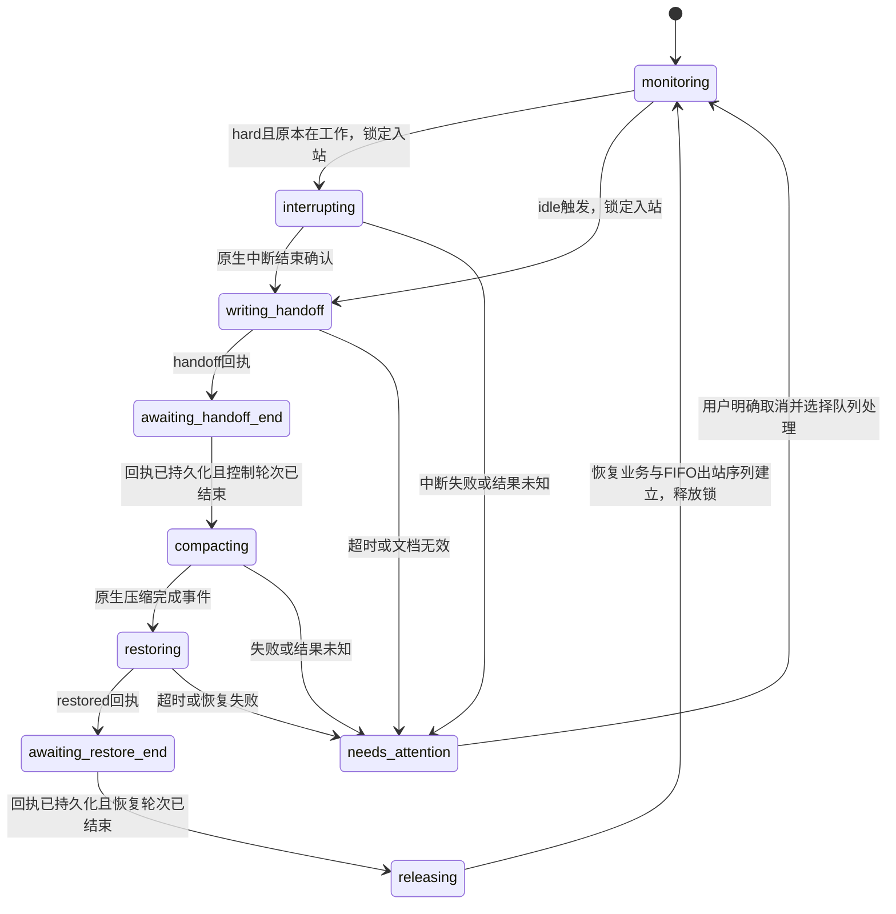

# 自动上下文管理设计

版本：设计稿 v1，2026-09-07。状态：供后续实施的设计；当前产品尚未运行自动阈值管理。

> 实施更新：此设计保留原始决策依据。实现和专用原生验收已推进，最新范围见 [Validation](VALIDATION.md)。

## 1. 目标与已确定需求

Cooperation 按每个原生会话独立监测上下文、暂停业务、保存交付文档、压缩、恢复上下文和继续任务。保留 Codex 桌面 App 与 Claude Code VS Code 官方面板。多个项目目录的会话可以同时出现在同一个管理页并相互通信。

每个会话以 `(hostId, client, sessionId)` 唯一标识；本期 hostId 为 local。会话名称、项目目录和界面标签均不作为身份。改名不改变策略，目录改变不隐式复制其他会话的设置。模型、思考强度和权限模式沿用原会话，管理流程不切换它们。

用户确定两个可修改的会话级阈值：

| 客户端 | 空闲触发阈值 soft | 强制暂停阈值 hard |
| --- | ---: | ---: |
| Codex | 40% | 55% |
| Claude | 50% | 80% |

采用 `>=` 比较，hard 优先。会话实际采用的两个值单独持久化，修改 A 不影响 B。客户端默认值只用于第一次创建会话策略；修改默认值不追改已有会话。校验 `0 < soft < hard < 100`；临时在专用测试会话设置低值应显式显示为测试策略。

用户要求的完整顺序是：触发 → 写交付文档 → 第一次系统确认 → 原生压缩完成 → 加载交付文档和必要文件 → 第二次系统确认 → 需要时继续原任务 → 释放期间收到的消息。普通聊天中的文本 OK 不作为流程完成凭据。

## 2. 运行状态与能力边界

“激活”指业务轮次正在执行，与面板是否前台、标签页是否可见不同。

| activity | 含义 | soft处理 | hard处理 |
| --- | --- | --- | --- |
| idle | 客户端可用，轮次结束，无待答权限/问题 | 启动流程 | 启动流程，记录原本未工作 |
| running | 正在推理或执行工具 | 继续业务，达到hard前不插入交付请求 | 先停止业务轮次，再开始交付流程 |
| waiting_permission / waiting_input | 活跃轮次停在权限或用户答复 | 不当作空闲压缩 | 请求原生中断，不代答原问题；确认中断成功后再交付 |
| initializing | 正在启动或恢复进程 | 等待可用 | 等待状态确认后执行 |
| unloaded | Codex会话已存储但当前未装入后台 | 确认客户端可唤醒原ID后才能启动流程 | 同左，不能把未装载当正在工作 |
| offline | App/插件目标进程不可达 | 标记等待上线 | 标记等待上线；保留已创建流程的状态 |
| unknown | 证据冲突、连接丢失或无法判定 | 暂不决策 | 先刷新状态，失败则需要处理；不猜测或终止进程 |

定义 `wasWorkingAtTrigger` 为触发时 running、waiting_permission、waiting_input 中的一种。它只在流程创建时记录一次，写交付和加载文档阶段的短暂忙碌不能改写这个值。等待人类答复的业务恢复后仍沿用原权限流程，不能自动选择答案。

**当前确认程度：**

- Claude：外部访问 wrapper `/status` 已读到真实空闲状态；流观察器已通过忙碌、权限待答等模拟测试。当前 busy 状态尚需增加轮次/活动版本、权限请求分类及异常断线核对，才能作为自动控制契约。
- Codex：独立程序已从开发任务读到 task_started，从测试任务读到 task_complete。日志可以提供活动线索，但崩溃也可能留下未完成的 start。原生 App Server 有 thread/status/changed、turn/started/completed；桌面内部已有对应会话协调通道，实时接入和异常情况须在 P1 验证。
- 中断：本机代码确认 Codex `thread-follower-interrupt-turn` → `turn/interrupt`；Claude SDK 有 control_request(interrupt)。本轮仅检查代码，没有真正中断会话。这两条外部中断路径必须在专用测试会话验收后，才开放hard策略。
- 已完成的独立压缩与用量读取见 verification 中的验收文档；不能用它们替代活动状态、中断和完整流程验收。

adapter 统一返回 `connected, activity, activityRevision, activeTurnId, observedAt, instanceId, capabilities`。未知字段明确为空。执行中断前重读状态并校验预期轮次/版本，防止旧状态中断刚启动的新轮次。

## 3. 用量口径与触发规则

本设计先固定分母，避免阈值看似相同、实际计算不同：Codex 使用运行事件的有效 model_context_window；Claude 使用原生 rawMaxTokens 完整模型窗口。管理页同时显示具体 token 数、分母、来源和观测时间。可另显示“距离客户端自动压缩的余量”，但它不参与本期40/55与50/80计算。

Codex 使用 last_token_usage.total_tokens，绝不使用累计total_token_usage。Claude优先使用原进程get_context_usage；业务执行期间需从原协议流的主会话usage与modelUsage容量增量更新。现有get_context_usage入口只允许空闲，单靠轮询该入口无法实现80%忙碌强停，必须先补齐被动流监测。缓存读入、缓存创建均属于上下文，不可漏计。

用量记录包含 `usedTokens, capacityTokens, percent, model, source, measuredAt, contextEpoch, historyRevision`。连接状态的新鲜度与用量时间分开判断：空闲且历史未变时旧快照仍可使用；正在执行时出现新消息但没有新统计，应标记滞后并等待新证据。模型或窗口变化后重新计算；不猜容量。压缩后递增contextEpoch并使旧值失效。

决策表：

| 条件 | 动作 |
| --- | --- |
| 会话未启用管理 / 已有maintenance流程 | 不创建新流程 |
| 百分比、容量或运行状态未知 | 刷新，仍未知则显示原因 |
| percent < soft | 继续监测 |
| soft <= percent < hard 且业务活跃 | 继续业务；业务转idle时立即重判，不要求再次跨越soft |
| soft <= percent < hard 且idle | 创建软触发流程 |
| percent >= hard且已确认业务活跃 | 创建硬触发流程并请求中断 |
| percent >= hard且idle | 创建硬触发流程，跳过中断步骤 |

建议事件驱动处理流状态与用量，外部日志初期按约2秒增量读；闲置对象按约10秒检查连接。原生上下文细分查询按需或空闲后刷新，不对每个会话每秒执行昂贵计算。阈值调整在下一次有效采样重新判断；活动流程沿用创建时的策略快照。

同一contextEpoch内只触发一个流程。维护中的交付/恢复轮次不再次触发自身hard阈值。恢复后根据新的epoch、业务进展和用量重新布防；若交付文件过大导致恢复即再次超限，报告“恢复后仍超阈值”而不是无限压缩循环。超过原生绝对窗口仍需失败处理，hard阈值不是原生容量上限。

## 4. 持久化流程与会话锁

每次维护分配独立cycleId与lease fencing版本。会话入站锁从流程创建的事务开始获得，覆盖暂停、写交付、压缩和恢复，而不只覆盖压缩本身。不同会话可分别运行，不设全局会话锁。



MCP/CLI回执会在工具调用尚未返回时到达服务，因此不能一收到第一个回执就立刻压缩。服务先持久化回执并返回accepted，让工具正常结束，再等对应控制轮次结束/空闲。这也适用于第二个回执之后释放队列。

硬暂停表示原生中断当前业务轮次，不使用OS挂起、kill进程或关闭面板；工具中断并不回滚已经写入的文件。交付提示应要求记录被打断的工具、未提交修改及需复查的副作用。后台服务和子agent的暂停/继续行为须单独验证，不默认清空后台终端。

Codex暂停候选使用current-turn条件：本机内部 `thread-follower-interrupt-turn` local version4，传expectedTurnId；不要无轮次地调用“user-stop”路径，其代码可能清理后台执行并暂停goal。活动goal或子agent可能自动续跑时，adapter需明确hold/恢复机制并保持原状态，未验证前相应会话标为hard能力不完整。

Claude暂停通过wrapper的独立SDK interrupt请求，不代答权限。维护提示、恢复提示应经同一个wrapper输入流发送，使队列和控制轮次可关联；普通peer消息保持原协议。当前wrapper没有interrupt和maintenance-prompt入口，需要新增并复用自己的control_response隔离机制。

## 5. 结构化确认协议

新增一个窄业务工具：`context_checkpoint`。MCP仍不向agent提供会话列表、任意管理或其他会话历史。该新增工具是用户本次明确提出的系统确认能力，与此前仅有send_message的范围变化保持清晰。

概念输入：

```json
{
  "cycleId": "本流程UUID",
  "stage": "handoff",
  "receiptToken": "本阶段一次性凭证",
  "documentPath": "本会话工作目录内的交付文档绝对路径"
}
```

第二阶段stage为`restored`。发送者由调用环境自动识别，不能自填任意senderId。凭证绑定会话、cycle、阶段、有效租约；只接受当前阶段的期望会话，拒绝其他会话、旧cycle、乱序及阶段混用。重复合法回执返回原结果，不重复推进。

CLI备选：`coop context checkpoint --cycle ... --stage handoff|restored --receipt-token ... --document ...`。现有CLI/MCP身份识别可复用，但Claude祖先进程匹配要覆盖已存在的launcher→node→Claude→tool层级。若权限阻止执行CLI，流程显示等待处理并按原审批机制办理，不改permissions。普通最终回复OK可作为给用户看的文本，状态机只认结构化回执与对应轮次结束。

成功第一阶段除回执外，还验证交付文档存在、非空、可读取和属于该会话获准工作目录，保存内容hash与相对路径。服务可把副本存入本项目的maintenance存储。禁止把聊天正文中的任意路径当成已授权文件写入目标。

默认建议文档放在目标会话自己获准的工作目录：`.cooperation/handoffs/<client>/<sessionId>/<cycleId>.md`，由该会话写入。若目标规则不允许该位置，使用其已授权位置或请求用户指定。当前主任务不会据此直接在其他项目写文件。中央配置、队列和副本均留在Cooperation；具体跨目录文件操作要遵守用户及目标会话授权。

## 6. 提示词模板

提示词是控制流程文本，附带cycleId、阶段和精确路径，区别于普通agent间报告。不会把“维护中的OK规则”加入普通消息。

### 保存交付

> 现在进行一次上下文维护，流程 {cycleId}。请暂停推进原业务任务，把接续工作需要的信息写入 {handoffPath}：目标和用户约束、已完成内容、关键决定、文件及命令、验证结果、当前未完成事项、下一步，以及刚被中断的操作和需要复查的副作用。记录当前模型、思考强度和权限的可确认信息；不要改变它们。只记录接续所需内容，不复制整段聊天。写好并确认文件可读后，调用 context_checkpoint，stage=handoff，传入本流程与阶段凭证、文档路径。收到 accepted 后结束本轮；暂不继续业务任务，等待恢复指令。若不能写入或回执失败，请说明具体阻碍，不报告成功。

### 压缩后恢复

> 开始加载上文，流程 {cycleId}。请读取 {handoffPath}，以及文档指出且当前接续必要的文件，恢复目标、约束、已完成事项和下一步。保留原模型、思考强度与权限，不自行开始业务执行。准备好后调用 context_checkpoint，stage=restored，使用本阶段凭证。收到 accepted 后结束本轮，等待系统释放消息或恢复任务。

### 继续任务

仅当wasWorkingAtTrigger=true，且未被用户取消/改任务、没有需要用户处理的权限阻碍时发送：

> 上下文维护已完成。继续工作：按交付文档接续刚才暂停的原任务，先复查中断操作的状态，避免重复执行已完成的副作用。随后按时间顺序处理收到的协作消息。

soft触发的原本空闲会话不额外发送“继续工作”；排队消息到达后可自然开启新轮次。

## 7. 消息锁、排队与释放

所有经Cooperation发送的普通消息都必须经过同一个admission入口，包括CLI、MCP和管理服务内部发送路径。由接收会话的锁决定投递或入队。发送方不因对方被锁而阻塞整个工具调用；返回messageId、status=queued、原因与cycleId。先持久化再返回成功。

按接收方分配递增sequence，保存正文、身份名称快照、接收时间和发送者，保证FIFO。锁期间新到消息持续排队。控制提示和checkpoint走单独的窄维护通道，只允许当前cycle，不与普通消息互相等待。

第二回执并结束恢复轮次后，在一个事务中决定是否生成一次“继续工作”控制项，并为旧队列与新消息建立统一出站顺序。设计顺序为：需要时先发一次继续工作，再按FIFO投递普通队列。恢复命令不是工作完成确认，普通消息可沿用客户端原有start/steer规则。新的消息不能绕过旧队列插队。

持久化出站项目后释放maintenance锁，由同一接收方dispatch串行器发送。锁释放并不意味着队列都已读或任务完成。不同接收方的队列互不阻塞。

服务发送后超时或断线，状态unknown并暂停该接收方后续自动发送，避免不确定重试造成重复报告或任务执行。应用没有通用幂等投递ACK，因此本期承诺持久化入队与稳定顺序，不承诺网络投递exactly-once。明确未发送的故障可按规则重试，结果不明的故障需对账或用户确认。

此队列首先覆盖维护期间的消息，不自动把所有普通离线发送改为无限重试。维护中客户端掉线，现有队列保留并等待恢复。

**锁的实际边界：**第一阶段能保证所有Cooperation管理入口的普通消息被排队。用户直接在原生界面输入、其他工具直接调用客户端内部接口，可能绕过服务。Claude可进一步在wrapper处隔离原面板user输入并提示排队；peer inbox仍是另一入口。Codex原生输入锁未验证。遇到可观察的外部输入或用户停止时，进入user_intervened并停止自动推进，保留队列，不能宣称已实现全客户端不可绕过的锁。若用户要求拦截所有来源，需要作为独立能力验收。

## 8. 多目录与管理页

把当前单一directory输入改为目录集合：每项包含id、label、path、recursive、enabled。支持添加、移除、选择多个目录、查看全部与按目录筛选；递归选项逐目录设置。多个目录是会话发现和展示范围，不指定同步主从关系。

按真实路径规范化、处理大小写与Windows extended path；重叠根与递归目录去重。会话只展示一次，保留所属目录集合。某目录失效时显示该目录错误，其他目录正常显示。会话策略按身份绑定，不因改变筛选或移除目录而丢失。移除正在维护的目录前，先让用户选择停管或保留流程，队列不得随筛选丢失。

消息历史支持多目录并集：发送方或接收方属于任一选定目录就匹配，因此不同项目间的消息仍能追踪。消息名称快照保持原样。目录浏览是用户管理能力，agent仍不能枚举其他会话。

管理行显示：客户端/名称/ID/当前目录、在线与活动状态、实际模型与统计时间、token用量及口径、独立soft/hard、启用开关、维护阶段、队列条数、最近失败。编辑阈值时明确是当前会话或客户端默认值，避免重复出现模型全局沿用那类隐藏作用域问题。

实施默认建议：添加目录先展示会话，由用户逐个或批量启用自动管理；新增会话初始不自动接管。全局默认仅预填阈值。这个选择作为设计假设保留，若用户要求发现即自动纳管，再提供明确开关。

Claude当前wrapper控制端点只在Cooperation目录启用。添加其他目录后需同步明确启用的wrapper目录并让相关Claude会话重开；管理页展示“待重开接入”。wrapper应支持校验后的目录配置刷新，避免把UI能看见会话误当成已具备控制能力。

## 9. 存储、恢复与故障

建议使用Node内置SQLite建立`.cooperation/management.sqlite`，使策略、cycle、锁、回执、消息队列和出站意图在一个事务内一致；不增加npm依赖。推荐表：directories、session_policies、runtime_snapshots、maintenance_cycles、checkpoints、messages、outbox、manager_leases、events。

现有messages.jsonl先保留，按消息ID幂等导入后核对数量、正文hash、身份快照与状态。迁移先在副本验证，停旧服务后切换；不同时把两种存储当可写权威源。旧日志保留备份，读取兼容可以逐步下线。session_policies包含enabled、softPercent、hardPercent、usageBasis、policyRevision和创建来源；cycle保存触发数据、wasWorkingAtTrigger、原轮次、模型/权限快照、各阶段时间及nonce摘要。

进程级单实例锁与每会话lease分开。重启加载非终态cycle并检查原生状态、文档与最近回执；过期lease允许新manager取得控制权，但不会自动释放收件锁。每个外部副作用先记intent，回执后记结果。崩溃发生在发送与写结果之间时进入reconciling；不能盲目重复中断、控制提示或压缩。

初始建议超时：状态请求5秒、中断确认30秒、写交付10分钟、压缩5分钟、恢复5分钟，均可配置。到期转needs_attention并保留锁/队列；用户可重试明确失败步骤、检查原会话、取消流程并决定消息释放。超时不是OK，进程退出也不是空闲完成。

业务可能通过原生goal、子agent、长运行工具继续活动；能力不完整的目标不能启用hard自动化。状态机须处理用户取消、后台自启、模型变化、容量未知、原生自动压缩抢先发生、部分文档、重复回执、服务重启与重复实例。

## 10. 验收标准

两端各验证一次soft-idle完整流程与一次hard-running中断流程。每次检查两次结构化回执、对应轮次结束、原生压缩完成、原ID/进程保持、wasWorking条件恢复和FIFO消息投递。达到soft但仍working不应发交付请求；达到hard时不得等业务自然结束。

补充测试：多目录重叠/跨项目消息；A改阈值不影响B；并发A维护不阻塞B；写交付阶段收到消息；ACK调用返回前不压缩；第二ACK前不释放；维护中崩溃；模糊投递超时不重复；权限待答不代答；新旧活动轮次竞争；模型/effort/权限与未纳管项目启动不变。

本轮交付设计与计划。后续按实施计划逐段实现，不把上述模块、锁或自动管理描述成当前已存在。
